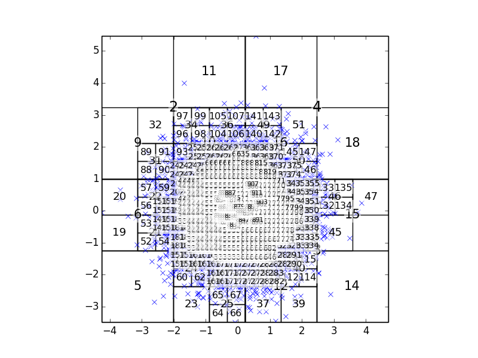

Welcome to boxtree's documentation!
===================================

boxtree is a package that, given some point locations in two or three
dimensions, sorts them into an adaptive quad/octree of boxes, efficiently, in
parallel, using OpenCL. It also computes geometric lookup tables and
generates FMM interaction lists.

Other places on the web to find boxtree stuff:

* `wiki home page <http://wiki.tiker.net/BoxTree>`_
* `github (source code, bug tracker) <http://github.com/inducer/boxtree>`_

Now you obviously want to watch the library do something (at least mildly)
cool? Well, sit back and watch:

.. literalinclude:: ../examples/demo.py
   :start-after: STARTEXAMPLE
   :end-before: ENDEXAMPLE

This file is included in the :mod:`boxtree` distribution as
:download:`examples/demo.py <../examples/demo.py>`.  With some plotting code (not shown above, but
included in the demo file), you can see what's going on:

More importantly, perhaps, than being able to draw the tree, the :class:`boxtree.Tree`
data structure is now accessible via the ``tree`` variable above, and the connectivity
information needed for an FMM-like traversal is available in ``trav`` as
a :class:`boxtree.traversal.FMMTraversalInfo`.

Overview
--------

.. toctree::
    :maxdepth: 3

    intro
    tree
    traversal
    fmm
    lookup
    cost
    misc
    🚀 Github <https://github.com/inducer/boxtree>
    💾 Download Releases <https://pypi.python.org/pypi/boxtree>

Indices and tables
------------------

* :ref:`genindex`
* :ref:`modindex`
* :ref:`search`

.. vim: sw=4
